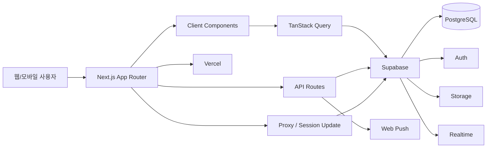

# MRO 기업 제출용 DX/AX 레퍼런스 문서

## 1. 문서 목적

이 문서는 청파중앙교회 교육위원회 관리 시스템 프로젝트를 기반으로, 지원자가 수행한 DX/AX 관점의 설계 및 구현 경험을 회사 제출용 레퍼런스로 정리한 문서이다.

이 문서의 목적은 단순히 "교회용 서비스"를 소개하는 것이 아니라, 실제 운영 조직의 업무를 디지털화하고, 권한 체계와 데이터 거버넌스를 유지하면서, 향후 AI 기능을 안전하게 접목할 수 있도록 설계한 경험을 보여주는 데 있다.

활용 방법:

- 본 문서를 기본 설명서로 사용한다.
- 스크린샷 자리 표시자에 실제 화면 캡처를 삽입한다.
- 필요 시 회사명 또는 지원 포지션에 맞게 표지와 요약 문구를 조정한 후 PDF로 변환한다.

## 2. 한눈에 보는 프로젝트

### 프로젝트명

청파중앙교회 교육위원회 관리 시스템

### 프로젝트 성격

- 운영형 웹 애플리케이션
- 모바일 우선 업무 시스템
- 역할 기반 권한 통제 시스템
- 보고, 승인, 알림, 회의, 통계, 회계 기능을 갖춘 운영 플랫폼

### 기술 스택

| 구분 | 기술 | 역할 |
| --- | --- | --- |
| 프론트엔드 | `Next.js 16 App Router`, `React 19`, `TypeScript strict` | 구조화된 웹 애플리케이션 개발 |
| UI | `Tailwind CSS v4` | 모바일 우선 반응형 UI |
| 상태/데이터 | `TanStack Query` | 서버 상태 조회, 캐시, 무효화 |
| 백엔드 플랫폼 | `Supabase` | PostgreSQL, Auth, RLS, Storage, Realtime |
| 알림 | `web-push` | 브라우저 푸시 알림 |
| 배포 | `Vercel` | 운영 배포 |

### 핵심 구현 기능

- 출결 관리
- 보고서 작성 및 승인
- 교인/멤버 관리
- 회계 및 지출결의
- 심방/방문 일정
- 통계 대시보드
- 알림 및 푸시
- 회의 관리 및 구조화된 회의록

## 3. 이 프로젝트를 DX/AX 레퍼런스로 볼 수 있는 이유

이 프로젝트는 단순 CRUD 화면 모음이 아니라, 운영 조직의 반복 업무를 표준화하고 디지털 흐름으로 전환한 사례다.

DX 관점에서 보여주는 점:

- 업무 입력, 승인, 조회, 통계 흐름을 하나의 시스템으로 통합
- 역할 기반 접근 제어와 데이터 범위 통제를 실제 서비스 구조에 반영
- 페이지, 훅, 권한 함수, API, DB 경계를 나누는 구조적 설계
- 운영 데이터 손실 가능성을 줄이기 위한 저장 경계 강화

AX 관점에서 보여주는 점:

- AI를 코어 기능에 억지로 섞지 않고, 확장 가능한 구조로 분리 설계
- 회의 내용을 구조화해 이후 요약, 결정사항 추출, Task 추천으로 확장 가능
- 알림, 승인, 회의, 보고 데이터를 기반으로 AI 보조 기능을 붙일 수 있는 데이터 기반 마련
- 권한 및 비용 추적이 가능한 방향으로 AI 기능을 plugin/add-on 개념으로 접근

즉, "업무 시스템을 만드는 역량"과 "AI를 붙일 수 있도록 미리 구조를 준비하는 역량"을 동시에 보여줄 수 있는 프로젝트다.

## 4. 시스템 아키텍처

### 4.1 상위 아키텍처

### 4.2 구조적 특징

#### 1. Thin Wrapper Page Pattern

`src/app`의 페이지는 얇게 유지하고, 실제 로직은 컴포넌트, 쿼리 훅, 유틸리티로 분리했다.  
이 방식은 페이지를 단순 진입점으로 유지해 유지보수성과 확장성을 높인다.

대표 경로:

- `src/app/(dashboard)/reports/...`
- `src/app/(dashboard)/meetings/...`
- `src/app/(dashboard)/members/...`

#### 2. 권한 로직의 중앙화

권한 체크는 [`src/lib/permissions.ts`](/C:/dev/church/src/lib/permissions.ts)에 집중되어 있다.

여기에서 다음과 같은 핵심 정책을 관리한다.

- 보고서 조회/수정 가능 여부
- 회의 생성 가능 여부
- 회의록 수정 가능 여부
- 회계 접근 가능 여부
- 멤버 수정 가능 여부

이 구조는 DX 측면에서 중요하다. 권한이 컴포넌트 곳곳에 흩어져 있으면 운영 시스템이 빠르게 복잡해지는데, 이 프로젝트는 이를 한 곳에 모아 관리하고 있다.

#### 3. Auth + RLS 기반 데이터 보안

클라이언트에서 버튼만 숨기는 방식이 아니라, Supabase Auth와 RLS를 사용해 데이터 계층에서도 접근 범위를 제어한다.

관련 구현 위치:

- `src/lib/supabase/server.ts`
- `src/lib/supabase/client.ts`
- `src/lib/supabase/middleware.ts`
- `src/types/database.ts`

이 점은 "보여주기용 UI"가 아니라 실제 운영 시스템으로 설계했다는 근거가 된다.

#### 4. 저장 경계의 신뢰성 강화

보고서 저장은 단순히 클라이언트에서 여러 테이블에 순차 저장하는 구조에 머물지 않았다.  
중요 저장 경계는 서버 라우트 검증과 DB RPC를 통해 강화했다.

관련 구현:

- 라우트: [`src/app/api/reports/save/route.ts`](/C:/dev/church/src/app/api/reports/save/route.ts)
- 저장 유틸: [`src/components/reports/utils/reportPersistence.ts`](/C:/dev/church/src/components/reports/utils/reportPersistence.ts)
- DB 함수: `public.save_report_bundle`

이 구조를 통해 다음을 달성했다.

- 권한 검증을 서버 경계로 이동
- 보고서 본문과 하위 데이터 저장의 일관성 강화
- 부분 실패 시 데이터 손실 위험 감소
- 운영 시스템에서 중요한 "저장 신뢰성" 개선

### 4.3 아키텍처 스크린샷 삽입 위치

- `[스크린샷 A] 시스템 아키텍처 다이어그램 또는 기술 구성 슬라이드`
- 권장 캡션: `그림 A. Next.js, Supabase, RLS, 알림 흐름으로 구성된 운영 시스템 아키텍처`

## 5. 기능 구현 레퍼런스

## 5.1 출결 관리

### 구현 목적

- 부서별 반복 출결 업무를 디지털화
- 현장 입력 속도 개선
- 관리자/리더 기준으로 빠르게 체크 가능한 UI 제공

### 구현 특징

- 날짜와 부서 기준으로 출결 조회 및 입력
- 예배 출석과 모임 출석을 분리 관리
- 즉시 반응형 업데이트
- 역할 및 부서 범위에 따른 접근 제한

관련 파일:

- [`src/app/(dashboard)/attendance/page.tsx`](/C:/dev/church/src/app/(dashboard)/attendance/page.tsx)
- [`src/components/attendance/AttendanceGrid.tsx`](/C:/dev/church/src/components/attendance/AttendanceGrid.tsx)

### MRO/기업 업무로의 치환

이 기능은 다음과 같은 업무로 치환 가능하다.

- 현장 점검 체크
- 작업 완료 체크리스트
- 재고 확인 라운드
- 정기 점검 이행 확인

### 스크린샷 위치

- `[스크린샷 1] 출결 관리 화면`
- 권장 경로: `/attendance`
- 권장 캡션: `부서 단위 운영 체크 입력 화면`

## 5.2 보고서 작성 및 승인 워크플로우

### 구현 목적

- 반복적인 운영 보고를 표준 양식으로 통일
- 승인 단계를 시스템화
- 상태 이력과 책임 주체를 명확히 관리
- 수작업 추적을 줄이고 알림 기반으로 전환

### 구현 특징

- 다양한 보고서 유형 지원
- 임시저장과 제출 분리
- 승인 상태 전이 관리
- 승인 이력 추적
- 자동 저장 및 로컬 백업 복원
- 서버 라우트 + RPC 기반 저장 신뢰성 강화

관련 파일:

- [`src/components/reports/ReportForm.tsx`](/C:/dev/church/src/components/reports/ReportForm.tsx)
- [`src/app/api/reports/save/route.ts`](/C:/dev/church/src/app/api/reports/save/route.ts)
- [`src/components/reports/utils/reportPersistence.ts`](/C:/dev/church/src/components/reports/utils/reportPersistence.ts)

### DX 포인트

- 단순 입력 화면이 아니라 실제 업무 흐름을 디지털 프로세스로 전환
- 승인 단계별 상태와 책임이 명확함
- 저장 실패나 부분 저장 위험을 줄이는 방향으로 개선

### MRO/기업 업무로의 치환

- 구매 요청서 작성
- 견적 검토 보고
- 유지보수 작업 결과 보고
- 지출 승인 요청
- 공급사 대응 결과 보고

### 스크린샷 위치

- `[스크린샷 2] 보고서 목록 화면`
- 경로: `/reports`
- 캡션: `상태 추적이 가능한 운영 보고 목록`

- `[스크린샷 3] 보고서 작성 화면`
- 경로: `/reports/new`
- 캡션: `구조화된 입력 폼과 자동저장 기반 보고 작성 화면`

- `[스크린샷 4] 보고서 상세/승인 화면`
- 경로: `/reports/[id]`
- 캡션: `승인 단계와 이력이 연결된 보고 상세 화면`

## 5.3 멤버 관리

### 구현 목적

- 인원 정보를 중앙에서 관리
- 검색과 필터 기반 조회 효율 향상
- 사진 및 부서 정보까지 포함한 운영 마스터 데이터 구성

### 구현 특징

- 리스트/그리드 보기 지원
- 부서 및 셀 기준 필터링
- 프로필 사진 업로드
- 다중 부서 소속 매핑 지원
- 모바일에서도 빠르게 찾을 수 있는 구조

관련 파일:

- [`src/components/members/MemberList.tsx`](/C:/dev/church/src/components/members/MemberList.tsx)
- [`src/components/members/MemberForm.tsx`](/C:/dev/church/src/components/members/MemberForm.tsx)
- [`src/components/members/BulkPhotoUpload.tsx`](/C:/dev/church/src/components/members/BulkPhotoUpload.tsx)

### MRO/기업 업무로의 치환

- 임직원 명부
- 공급사 담당자 관리
- 현장 책임자 관리
- 거래처 연락처 마스터 관리

### 스크린샷 위치

- `[스크린샷 5] 멤버 목록`
- 경로: `/members`
- 캡션: `검색 가능한 운영 마스터 데이터 목록`

- `[스크린샷 6] 일괄 사진 업로드`
- 경로: `/members/bulk-photos`
- 캡션: `일괄 데이터 보강을 위한 배치 업로드 화면`

## 5.4 회계 및 지출결의

### 구현 목적

- 부서 단위 회계 흐름 가시화
- 수입/지출 기록 표준화
- 지출 요청 프로세스 디지털화

### 구현 특징

- 월별 회계 원장 요약
- 지출결의 작성 및 조회
- 역할 기반 회계 접근
- 데스크톱/모바일에 맞춘 뷰 제공

관련 파일:

- [`src/components/accounting/AccountingClient.tsx`](/C:/dev/church/src/components/accounting/AccountingClient.tsx)
- [`src/components/accounting/AccountingLedger.tsx`](/C:/dev/church/src/components/accounting/AccountingLedger.tsx)
- [`src/components/accounting/ExpenseRequestForm.tsx`](/C:/dev/church/src/components/accounting/ExpenseRequestForm.tsx)

### MRO/기업 업무로의 치환

- 내부 구매 예산 관리
- 소액 비용 요청
- 부서별 집행 현황 추적
- 운영비 사용 이력 관리

### 스크린샷 위치

- `[스크린샷 7] 회계 대시보드`
- 경로: `/accounting`
- 캡션: `부서 단위 회계 현황 및 원장 관리 화면`

- `[스크린샷 8] 지출결의 작성`
- 경로: `/accounting/expense/new`
- 캡션: `구조화된 지출 요청 프로세스 화면`

## 5.5 회의 관리와 구조화된 회의록

### 구현 목적

- 회의 내용을 단순 자유 텍스트가 아니라 구조화된 데이터로 관리
- 회의 후속 업무를 추적 가능한 형태로 축적
- 향후 AI 기능이 붙을 수 있는 기반 데이터 확보

### 구현 특징

- 회의 기본 정보와 회의록 구조를 분리
- `meeting_minutes` 테이블 기반 확장 설계
- 논의 내용, 결정 사항, 인수인계 메모를 각각 저장
- 부서 권한 범위에 따라 편집 가능 여부 제어

관련 파일:

- [`src/components/meetings/MeetingDetail.tsx`](/C:/dev/church/src/components/meetings/MeetingDetail.tsx)

### AX 포인트

이 영역은 현재 시스템에서 AX와 가장 직접적으로 연결되는 부분이다.

이미 구조화되어 있는 데이터:

- 논의 내용
- 결정 사항
- 인수인계 메모

향후 여기에 AI를 붙이면 가능한 확장:

- 회의 요약
- 결정사항 추출
- 후속 Task 추천
- 다음 회의용 핸드오프 자동 정리

중요한 점은, 이 기능을 기존 코어를 깨는 방식이 아니라 additive change로 설계했다는 점이다.  
즉, 기존 운영 기능을 유지하면서 AI 기능을 붙일 수 있는 구조적 토대를 만든 사례로 설명할 수 있다.

### 스크린샷 위치

- `[스크린샷 9] 회의 목록`
- 경로: `/meetings`
- 캡션: `회의 이력과 기본 메타데이터 관리 화면`

- `[스크린샷 10] 구조화된 회의록 상세`
- 경로: `/meetings/[id]`
- 캡션: `논의, 결정, 인수인계가 분리된 AX 확장형 회의록`

## 5.6 알림 및 운영 후속 조치 자동화

### 구현 목적

- 승인 및 업무 후속 조치를 수작업 추적에서 이벤트 기반 추적으로 전환
- 업무 지연을 줄이고 사용자 반응성을 높임

### 구현 특징

- 인앱 알림
- 읽음/안읽음 상태 관리
- 브라우저 푸시 구독 및 발송
- 승인 상태별 수신자 매핑

관련 파일:

- [`src/components/notifications/NotificationBell.tsx`](/C:/dev/church/src/components/notifications/NotificationBell.tsx)
- [`src/lib/notifications.ts`](/C:/dev/church/src/lib/notifications.ts)
- [`src/lib/push.ts`](/C:/dev/church/src/lib/push.ts)

### MRO/기업 업무로의 치환

- 승인 대기 알림
- 구매 요청 확인 알림
- 공급사 응답 후속 알림
- 마감 일정 리마인드

### 스크린샷 위치

- `[스크린샷 11] 알림 패널`
- 권장 영역: 상단 알림 벨 + 드롭다운
- 캡션: `이벤트 기반 운영 후속 조치 알림 구조`

## 5.7 통계 및 운영 가시화

### 구현 목적

- 누적 운영 데이터를 경영/운영 인사이트로 전환
- 단순 기록이 아니라 추세 분석이 가능한 구조 제공

### 구현 특징

- 차트 기반 통계
- 부서 비교
- 기간 필터링

관련 파일:

- [`src/components/stats/StatsClient.tsx`](/C:/dev/church/src/components/stats/StatsClient.tsx)
- [`src/components/stats/StatsCharts.tsx`](/C:/dev/church/src/components/stats/StatsCharts.tsx)

### MRO/기업 업무로의 치환

- 구매 요청량 추이
- 부서별 처리량 분석
- 공급사 대응 속도 통계
- 작업 완료율 대시보드

### 스크린샷 위치

- `[스크린샷 12] 통계 화면`
- 경로: `/stats`
- 캡션: `운영 KPI와 추세를 시각화한 통계 대시보드`

## 6. DX 관점 핵심 정리

### 6.1 구조적 설계 역량

이 프로젝트에서 보여준 DX 역량은 다음과 같다.

- 페이지와 로직의 분리
- 쿼리 훅 중심 데이터 구조
- 권한 로직 중앙화
- 클라이언트/서버 Supabase 접근 분리
- 기존 코어를 깨지 않는 additive change 우선

### 6.2 보안과 거버넌스 인식

- 관리자 승인 기반 활성화 구조 (`is_active`)
- 역할 기반 접근 제어
- 부서 단위 데이터 범위 제어
- RLS 존중
- 서버 라우트 수준의 권한 검증

### 6.3 운영 신뢰성 개선

- 보고서 저장 경계 강화
- 하위 데이터 손실 위험 감소
- 자동저장 상태 분리
- 비정상 응답 처리 강화

이 부분은 단순히 "기능이 있다"가 아니라, 운영 중 발생할 수 있는 실패 상황을 어떻게 줄였는지를 보여준다. 회사 입장에서는 이런 부분이 실제 DX 역량으로 더 크게 보일 수 있다.

## 7. AX 관점 핵심 정리

### 7.1 현재 이미 구현된 AX 준비 요소

- 구조화된 회의록 데이터
- 보고/승인/알림 데이터 흐름
- 역할과 부서 범위가 명확한 권한 체계
- AI 기능을 별도 plugin/add-on 구조로 분리하려는 설계 철학

### 7.2 현재 구현 완료와 향후 AX 확장의 구분

#### 현재 구현 완료

- 구조화된 회의 기록
- 승인 기반 알림 자동화
- 보고 집계 및 운영 요약
- 역할 기반 데이터 통제

#### 향후 AX 확장 예정 방향

- AI Meeting Assistant
- 회의 요약 자동 생성
- 결정사항 추출
- Task 추천
- 사용량/비용 추적 가능한 AI 모듈

이 구분은 중요하다.  
실제보다 과장해서 "AI를 이미 다 구현했다"라고 말하는 것이 아니라, 현재는 AI-ready 구조를 만들었고, 이후 안전하게 붙일 수 있는 기반을 구축했다는 식으로 설명하는 것이 더 설득력 있다.

### 7.3 회사 제출용 AX 설명 문구 예시

> 이 프로젝트에서는 AI를 단순 부가 기능으로 붙이기보다, 먼저 운영 데이터와 권한 체계, 업무 흐름을 구조화하는 데 집중했습니다. 특히 회의록을 논의 내용, 결정 사항, 인수인계 메모로 분리해 저장함으로써 이후 요약, 의사결정 추출, Task 추천 같은 AI 기능을 독립 모듈 형태로 붙일 수 있는 기반을 만들었습니다. 이 접근 방식은 MRO 환경에서도 구매 요청, 공급사 미팅, 승인 보조, 후속 작업 관리 자동화에 그대로 확장할 수 있습니다.

## 8. MRO/구매대행 업무로의 연결 포인트

| 현재 프로젝트 기능 | MRO/구매대행 업무에 대응되는 개념 |
| --- | --- |
| 출결 체크 | 현장 점검/작업 수행 체크 |
| 주간 보고 | 구매/운영 리포트 |
| 승인 워크플로우 | 구매 승인/비용 승인 |
| 멤버 관리 | 직원/거래처/공급사 담당자 관리 |
| 회의록 | 공급사 미팅 기록 및 결정사항 관리 |
| 알림 | 승인 요청/응답/후속 조치 알림 |
| 통계 | 부서별 요청량, 처리량, KPI 시각화 |

이 표는 도메인이 달라도 시스템 설계 경험이 이식 가능하다는 점을 보여준다.  
즉, "교회 도메인 경험"이 아니라 "운영 시스템을 설계하고 디지털화한 경험"으로 읽히게 만드는 장치다.

## 9. 스크린샷 촬영 가이드

최종 제출본에는 아래 체크리스트에 따라 화면을 넣는 것을 권장한다.

| 번호 | 화면 | 경로 | 필요한 권한 | 촬영 포인트 | 파일명 예시 |
| --- | --- | --- | --- | --- | --- |
| 1 | 대시보드 | `/dashboard` | 활성 사용자 | 요약 카드, 빠른 이동, 최근 현황 | `01-dashboard.png` |
| 2 | 출결 관리 | `/attendance` | 팀장 이상 | 날짜/부서 선택과 체크 그리드 | `02-attendance.png` |
| 3 | 보고서 목록 | `/reports` | 활성 사용자 | 상태 필터, 목록 구조 | `03-report-list.png` |
| 4 | 보고서 작성 | `/reports/new` | 작성 권한 사용자 | 섹션형 입력 구조, 자동저장 상태 | `04-report-form.png` |
| 5 | 보고서 상세 | `/reports/[id]` | 승인 권한 계정 권장 | 승인 액션, 상태 흐름, 상세 내용 | `05-report-detail.png` |
| 6 | 멤버 목록 | `/members` | 편집 권한 계정 권장 | 검색, 필터, 목록/카드 | `06-members.png` |
| 7 | 일괄 사진 업로드 | `/members/bulk-photos` | 편집 권한 | 배치 업로드 구조 | `07-bulk-photo-upload.png` |
| 8 | 회계 화면 | `/accounting` | 회계/관리자 | 원장과 요약 카드 | `08-accounting.png` |
| 9 | 지출결의 작성 | `/accounting/expense/new` | 허용 권한 | 지출 요청 입력 폼 | `09-expense-request.png` |
| 10 | 회의 목록 | `/meetings` | 활성 사용자 | 회의 목록과 메타데이터 | `10-meetings.png` |
| 11 | 구조화된 회의록 | `/meetings/[id]` | 편집 권한 권장 | 논의/결정/인수인계 구분 | `11-meeting-minutes.png` |
| 12 | 알림 패널 | 상단 드롭다운 | 활성 사용자 | 알림 벨과 드롭다운 | `12-notifications.png` |
| 13 | 통계 화면 | `/stats` | 관리자 권한 | 차트와 추세 | `13-statistics.png` |

### 스크린샷 촬영 규칙

- 데스크톱 화면은 가능한 동일 폭으로 맞춘다.
- 개인정보는 반드시 블러 처리한다.
- 브라우저 UI는 최소화한다.
- 모바일 우선 UX를 보여주고 싶다면 모바일 캡처 1~2장을 추가한다.
- 캡션 형식은 `그림 X. [업무적 의미]`로 통일한다.

## 10. 제출 자료 구성 권장안

최종 제출본은 아래 순서가 가장 자연스럽다.

1. 프로젝트 개요
2. 시스템 아키텍처
3. 주요 기능 구현
4. DX 포인트
5. AX 접목 및 확장 방향
6. MRO 업무 적용 가능성
7. 스크린샷 부록

## 11. 근거 코드 및 문서

핵심 근거 파일:

- 권한 체계: [`src/lib/permissions.ts`](/C:/dev/church/src/lib/permissions.ts)
- 보고 저장 라우트: [`src/app/api/reports/save/route.ts`](/C:/dev/church/src/app/api/reports/save/route.ts)
- 보고서 폼: [`src/components/reports/ReportForm.tsx`](/C:/dev/church/src/components/reports/ReportForm.tsx)
- 회의 상세: [`src/components/meetings/MeetingDetail.tsx`](/C:/dev/church/src/components/meetings/MeetingDetail.tsx)
- 알림 로직: [`src/lib/notifications.ts`](/C:/dev/church/src/lib/notifications.ts)
- 기술 문서: [`docs/TECHNICAL_SPEC.md`](/C:/dev/church/docs/TECHNICAL_SPEC.md)
- 사용자 흐름 문서: [`docs/USER_GUIDE.md`](/C:/dev/church/docs/USER_GUIDE.md)

## 12. 마무리 정리

이 프로젝트를 회사 제출용 레퍼런스로 설명할 때 가장 강하게 가져갈 포인트는 다음과 같다.

- 단순 소개 페이지가 아니라 실제 운영 업무 시스템이라는 점
- 승인, 권한, 데이터 보안, 알림까지 포함한 운영 흐름을 설계했다는 점
- 실패 가능성을 줄이기 위해 저장 경계를 강화했다는 점
- AI를 무리하게 붙이지 않고, 나중에 안전하게 붙일 수 있도록 구조를 만들었다는 점
- 도메인은 교회이지만, 업무 시스템 설계 경험은 MRO/구매대행 환경으로 충분히 전환 가능하다는 점

## 13. 다음 확장 가능 항목

원하면 다음 버전도 이어서 만들 수 있다.

- 더 정제된 한국어 제출본 1~2페이지 요약본
- 자기소개서/포트폴리오용 문체로 압축한 버전
- PPT 목차형 버전
- MRO 구매대행 업무에 맞춘 용어 치환 버전
- 실제 스크린샷 삽입용 최종본
